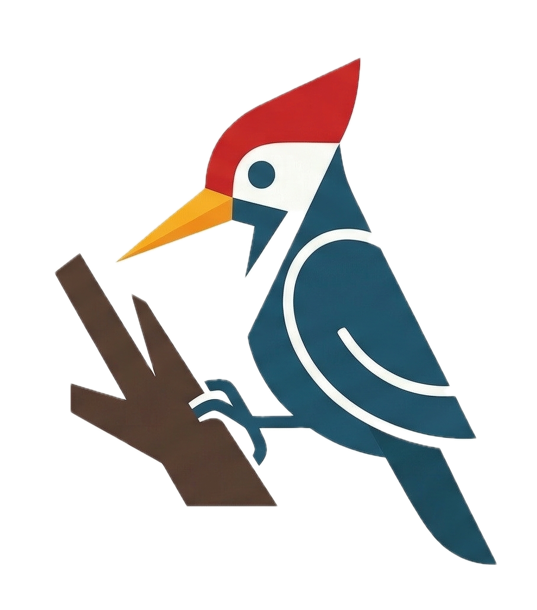

# Woodpecker



Turn your entire Apple Silicon MacBook into a giant, customizable macro-pad. Woodpecker runs silently in the background and uses the hardware-level accelerometer (IMU) to detect physical knocks or taps on your laptop chassis. You can map any tap sequence to execute custom terminal commands, AppleScript, or native macOS Shortcuts.

---

## ⚠️ Prerequisites & Compatibility

### System Requirements

- **Apple Silicon Mac (M2, M3, M4, M5+):** Requires the Sensor Processing Unit (SPU)
  - ❌ Not compatible with Intel Macs
  - ❌ Not compatible with M1 MacBook Pro (2020)
- **Python 3.9+:** Must be installed on your system
- **macOS 13+:** Requires a recent macOS version

To verify your Mac has the required hardware, run:

```bash
sysctl -a | grep arm64
```

---

## 📥 Installation

Woodpecker installs as a User LaunchAgent. This ensures it runs within your graphical user session, giving it the necessary permissions to capture the screen, run Shortcuts, and execute AppleScript without security errors.

### Step 1: Download & Prepare

Clone the repository to your local machine:

```bash
git clone https://github.com/Vishal01Mehra/Woodpecker.git && cd Woodpecker
```

### Step 2: Run the Installer

Make the scripts executable and run the installer. The installer will automatically set up a Python virtual environment, install dependencies (macimu), and configure the background agent.

```bash
chmod +x scripts/install.sh scripts/uninstall.sh
./scripts/install.sh
```

---

## ⚙️ Configuration

Woodpecker stores its configuration in `~/.woodpecker/config.json`.

### Default Configuration

```json
{
    "settings": {
        "tap_threshold": 0.07,
        "tap_cooldown": 0.15,
        "multi_tap_window": 0.6
    },
    "actions": {
        "2": "shortcuts run 'Shortcut0' && echo 'Shortcut 0 executed!'",
        "3": "shortcuts run 'Shortcut1' && echo 'Shortcut 1 executed!'",
        "4": "shortcuts run 'Shortcut2' && echo 'Shortcut 2 executed!'",
        "5": "shortcuts run 'Shortcut3' && echo 'Shortcut 3 executed!'",
    }
}
```
### Adding Custom macOS Shortcuts

You can map tap sequences to trigger native macOS Shortcuts that you've created.

#### Step 1: Create a Shortcut in Shortcuts.app

1. Open **Shortcuts.app** on your Mac
2. Click **+** to create a new shortcut
3. Build your automation (e.g., send message, open app, control smart home devices, etc.)
4. Click **File** → **Rename** and give it a descriptive name (e.g., `PlayMusic`, `SendMessage`)
5. Click **Done** to save

#### Step 2: Add to Woodpecker Config

Edit `~/.woodpecker/config.json` and add your Shortcut to the `actions` object:

```json
{
    "settings": {
        "tap_threshold": 0.07,
        "tap_cooldown": 0.15,
        "multi_tap_window": 0.6
    },
    "actions": {
        "2": "shortcuts run 'PlayMusic' && echo 'Music started!'",
        "3": "shortcuts run 'SendMessage' && echo 'Message sent!'",
        "4": "shortcuts run 'ToggleLights' && echo 'Lights toggled!'"
    }
}
```
---

## 📊 Monitoring & Status

Since Woodpecker runs silently as a background agent, use the terminal to interact with it:

**Check if the service is running:**

```bash
launchctl list | grep com.mac.woodpecker
```

**Monitor live tap detection (Logs):**

```bash
tail -f ~/.woodpecker/woodpecker.log
```

> **Note:** If you see `IMU available. Listening for taps...` in the logs, your hardware is successfully connected!

---

## 🗑️ Uninstallation

To cleanly stop the background agent, remove the launch configuration, and delete all Woodpecker files and folders:

```bash
./scripts/uninstall.sh
```

---

## ⚖️ License

Woodpecker is released under **The Commons Clause License Condition v1.0**, based on the MIT License.

- ✅ **Free for:** Personal, educational, and non-commercial use. You can modify the source code for your own needs.
- ❌ **Not allowed:** Selling the software. "Sell" means providing the software, or services whose value derives substantially from its functionality, to third parties for a fee.
- ℹ️ **Distribution:** Any distribution must include the original copyright notice and the Commons Clause condition.

Copyright (c) 2026 Vishal Mehra. THE SOFTWARE IS PROVIDED "AS IS", WITHOUT WARRANTY OF ANY KIND.

